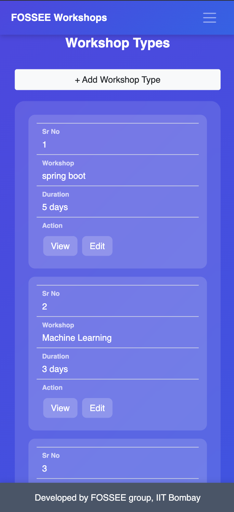

Workshop Booking UI/UX Enhancement (FOSSEE Task)

Project Overview

This project is a UI/UX enhancement of the original FOSSEE Workshop Booking System.

The goal was to improve:
	•	📱 Mobile responsiveness
	•	🎨 Modern UI design
	•	⚡ Performance
	•	♿ Accessibility
	•	🔍 User experience & navigation

The original system was functional but minimal. This redesign focuses on making it intuitive, visually appealing, and mobile-first.

🛠 Tech Stack
	•	HTML5 / CSS3
	•	Bootstrap / Custom CSS
	•	Django (existing backend)

Key Improvements

UI Enhancements
	•	Clean modern layout with gradients and glassmorphism
	•	Improved typography and spacing
	•	Better color contrast for readability

Mobile-First Design
	•	Fully responsive layouts
	•	Optimized forms and dashboards for small screens
	•	Improved button sizes and touch interactions

Dashboard Improvements
	•	Added structured cards and visual hierarchy
	•	Integrated charts (workshop trends, states, types)
	•	Better data representation

UX Improvements
	•	Simplified navigation
	•	Clear call-to-action buttons
	•	Improved forms (validation + spacing)

📸 Screenshots

🖥 Desktop View
                       

📱 Mobile View

                       

Design Decisions (Reasoning)

1. What design principles guided your improvements?
	•	Visual Hierarchy → Important elements like actions and stats are highlighted using size and color.
	•	Consistency → Same design language across all pages.
	•	Minimalism → Removed clutter and focused on essential elements.
	•	Accessibility → Better contrast, readable fonts, and spacing.

2. How did you ensure responsiveness?
	•	Used flexbox and responsive layouts
	•	Mobile-first approach (tested on small screens first)
	•	Optimized components for different screen sizes
	•	Used percentage widths instead of fixed sizes

3. Trade-offs between design and performance
	•	Avoided heavy animations to keep performance high
	•	Used lightweight styling instead of large UI libraries
	•	Limited external dependencies

4. Most challenging part

The biggest challenge was:

Making the existing Django-based UI modern without breaking functionality.

Solution:
	•	Carefully redesigned templates
	•	Maintained backend compatibility
	•	Tested each component after UI updates

⚙️ Setup Instructions

1. Clone repository

git clone https://github.com/your-username/workshop_booking.git
cd workshop_booking

2. Create virtual environment

python -m venv venv
source venv/bin/activate   # Mac/Linux
venv\Scripts\activate      # Windows

3. Install dependencies

pip install -r requirements.txt

4. Run server

python manage.py runserver

Features
	•	Workshop booking system
	•	Instructor & Coordinator dashboards
	•	Statistics & analytics
	•	Profile management
	•	Responsive UI

Submission

GitHub Repo: https://github.com/your-username/workshop_booking

Final Note

This project focuses on real-world UI/UX improvements while keeping performance and usability in mind.

## Live Demo