# 🚀 Workshop Booking UI/UX Enhancement (FOSSEE Task)

> A mobile-first redesign focused on improving usability, accessibility, and overall user experience for students.

---

## 📌 Project Overview

This project enhances the UI/UX of the original FOSSEE Workshop Booking System.

The goal was to improve:

- 📱 Mobile responsiveness  
- 🎨 Modern UI design  
- ⚡ Performance  
- ♿ Accessibility  
- 🔍 User experience & navigation  

The original system was functional but minimal. This redesign makes it more intuitive, visually appealing, and mobile-friendly.

---

## 🛠 Tech Stack

- HTML5 / CSS3  
- Bootstrap / Custom CSS  
- Django (existing backend)  

---

## 🚀 Key Improvements

### 🎨 UI Enhancements
- Modern layout with gradients and glassmorphism
- Improved typography and spacing
- Better color contrast for readability

### 📱 Mobile-First Design
- Fully responsive layouts
- Optimized forms for small screens
- Improved touch interactions

### 📊 Dashboard Improvements
- Structured cards for better hierarchy
- Improved data visibility
- Cleaner layout for better usability

### 🧭 UX Improvements
- Simplified navigation
- Clear call-to-action buttons
- Improved form design and validation

---

## 📸 Key Page Improvements (Before vs After)

> The following comparisons highlight major UI/UX improvements across important pages.

---

### 🔐 Login Page

| Before | After |
|--------|-------|
| 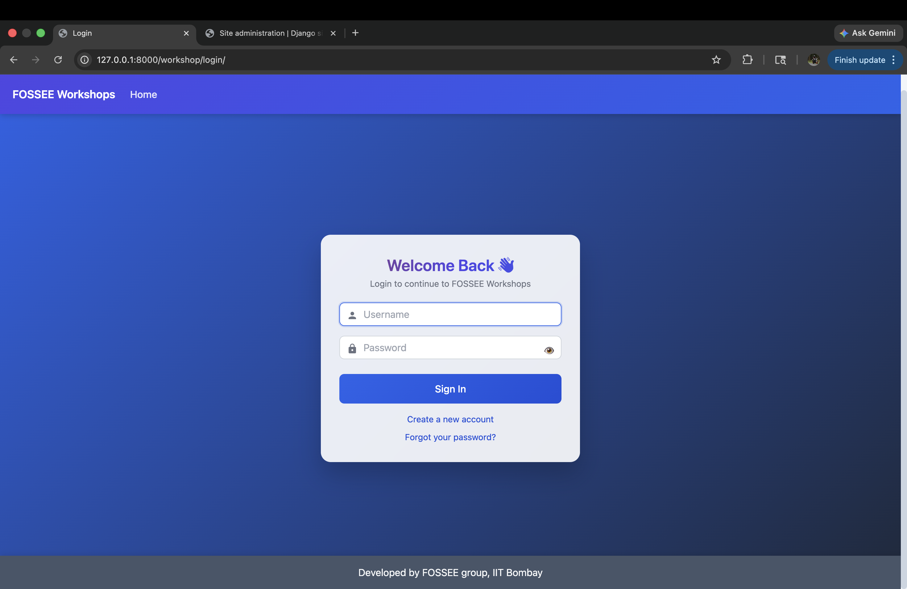 |  |

Basic non-responsive layout → Clean, centered, responsive design.

---

### 📊 Statistics Page

| Before | After |
|--------|-------|
| 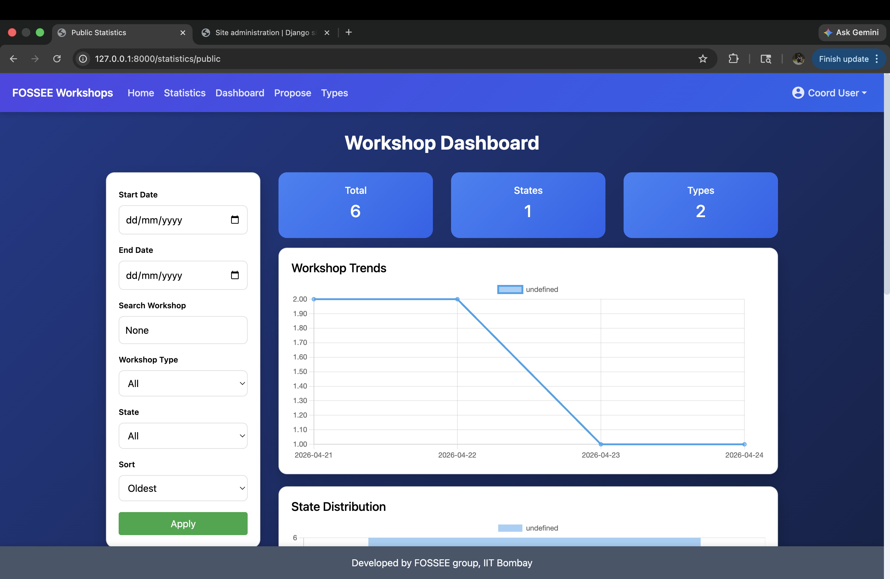 | 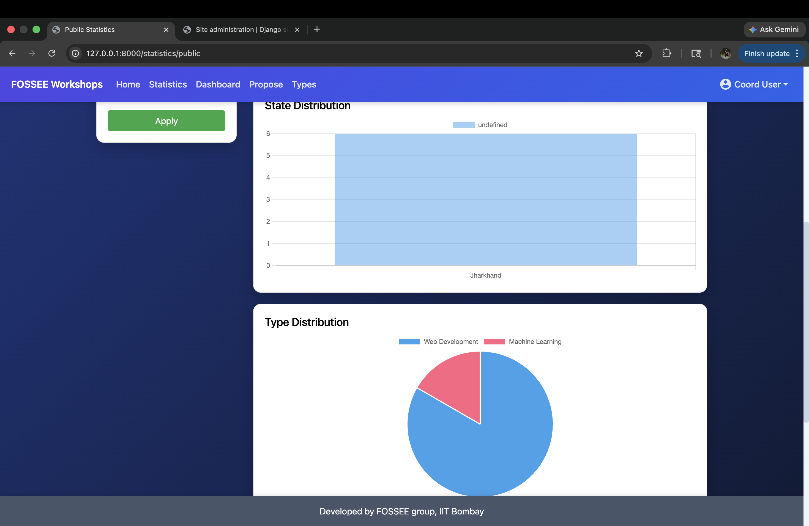 |

Rigid table → Improved layout with better spacing and readability.

---

### 👤 Profile Page

| Before | After |
|--------|-------|
| 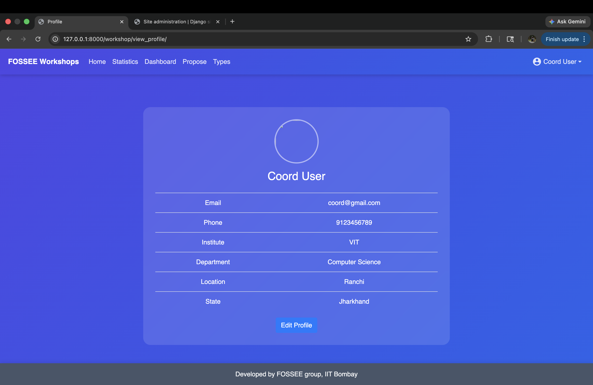 | 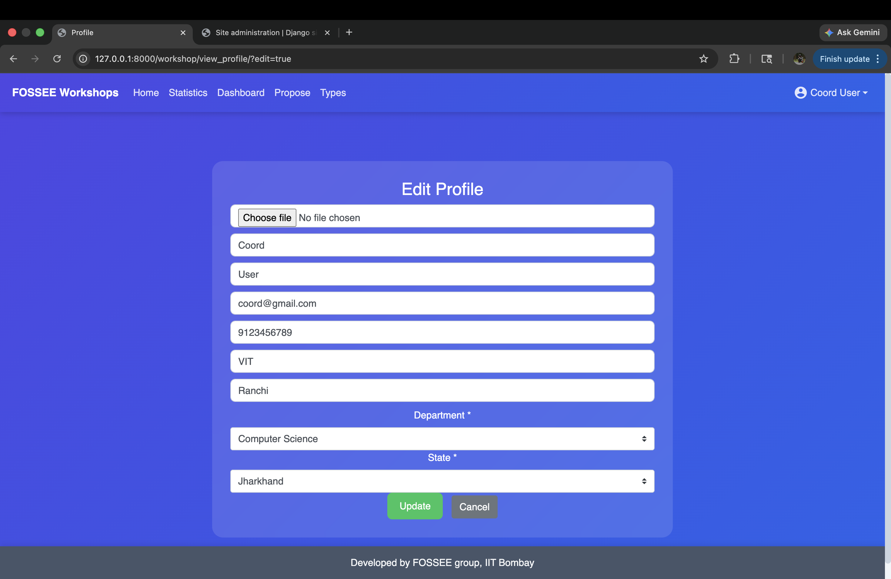 |

Cluttered form → Clean mobile-friendly UI with better spacing.

---

### 🧭 Dashboard

| Before | After |
|--------|-------|
| 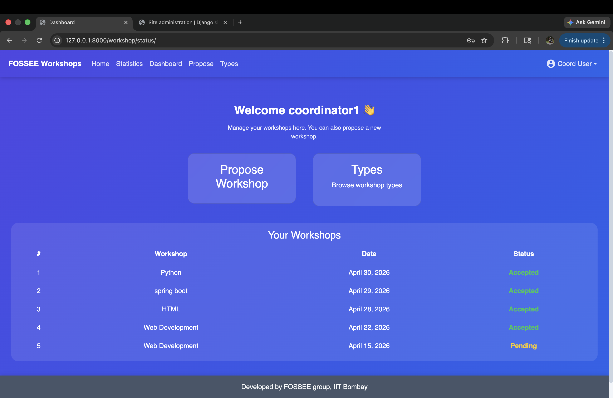 | 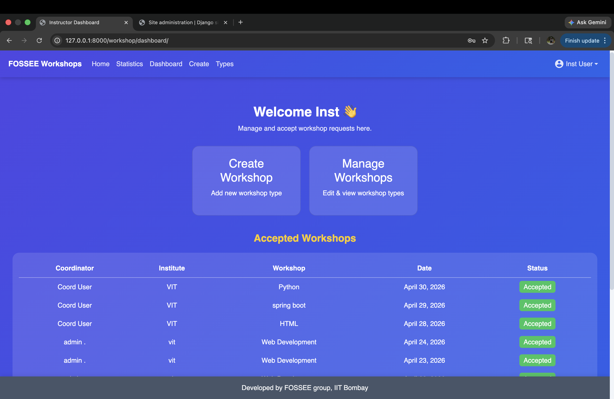 |

Flat layout → Structured layout with better visual hierarchy.

---

## 📱 Mobile UI Preview

| Screen | Preview |
|--------|--------|
| Dashboard | 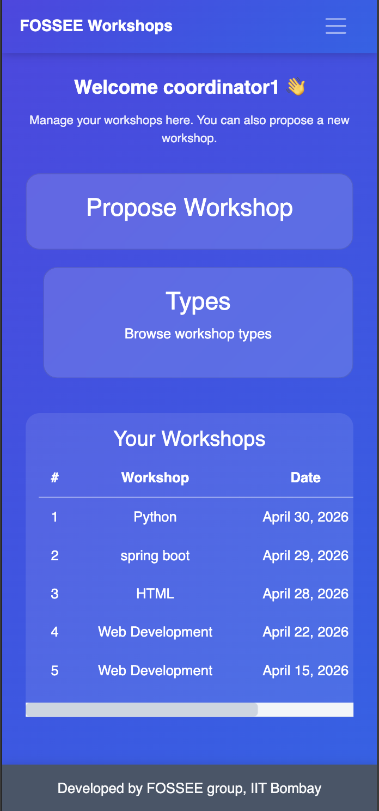 |
| Profile | 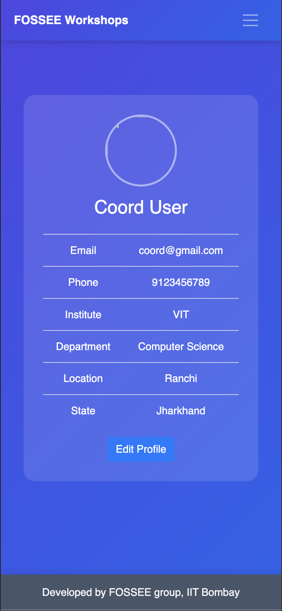 |
| Statistics | 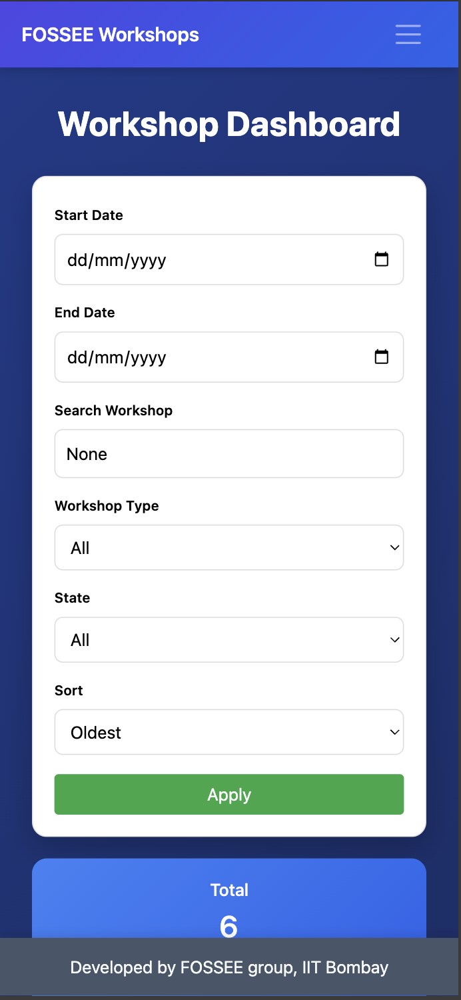 |
| Navigation | 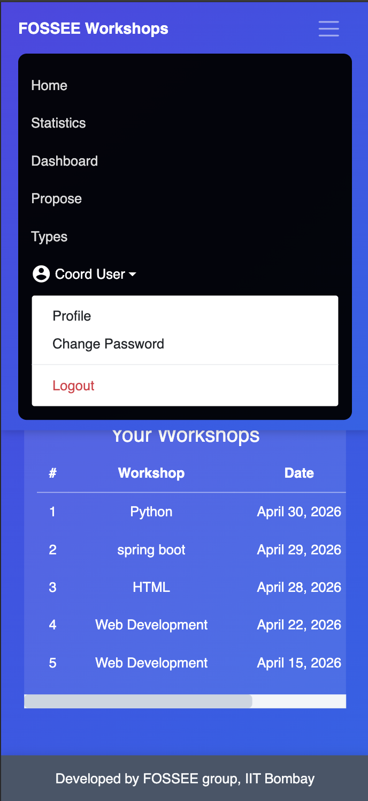 |

---

## 🧠 Design Decisions (Reasoning)

### 1. What design principles guided your improvements?

- **Visual Hierarchy** → Highlighted key actions and data  
- **Consistency** → Uniform design across all pages  
- **Minimalism** → Removed clutter  
- **Accessibility** → Improved contrast and readability  

---

### 2. How did you ensure responsiveness?

- Mobile-first approach  
- Used flexbox and responsive layouts  
- Avoided fixed widths  
- Tested across screen sizes  

---

### 3. Trade-offs between design and performance

- Avoided heavy animations  
- Used lightweight styling  
- Limited external dependencies  

---

### 4. Most challenging part

**Challenge:**  
Updating UI without breaking Django backend logic  

**Solution:**  
- Carefully modified templates  
- Preserved backend structure  
- Tested each component after changes  

---

## ⚙️ Setup Instructions

### 1. Clone repository
```bash
git clone https://github.com/your-username/workshop_booking.git
cd workshop_booking


2. Create virtual environment

python -m venv venv
source venv/bin/activate   # Mac/Linux
venv\Scripts\activate      # Windows


3. Install dependencies

pip install -r requirements.txt


4. Run server


python manage.py runserver