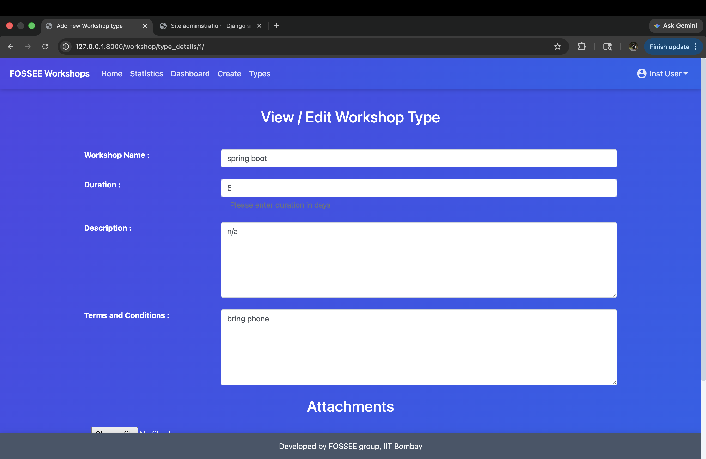

# 🚀 Workshop Booking UI/UX Enhancement (FOSSEE Task)


> A mobile-first redesign focused on improving usability, accessibility, and overall user experience.

---

## 📌 Project Overview

This project enhances the UI/UX of the existing **FOSSEE Workshop Booking System**.

### 🎯 Goals

* 📱 Improve mobile responsiveness
* 🎨 Modernize UI design
* ⚡ Optimize performance
* ♿ Enhance accessibility
* 🔍 Improve user experience

---

## 🛠 Tech Stack

* HTML5 / CSS3
* Bootstrap + Custom CSS
* Django (Existing Backend)

---

## 🚀 Key Improvements

### 🎨 UI Enhancements

* Modern gradient + glassmorphism design
* Better typography & spacing
* Improved readability

### 📱 Mobile-First Design

* Fully responsive layout
* Optimized forms for mobile
* Better touch interactions

### 📊 Dashboard Improvements

* Clean card-based layout
* Better data visibility
* Structured hierarchy

### 🧭 UX Improvements

* Simplified navigation
* Clear CTA buttons
* Improved form validation

---

## 🖥️ Desktop UI Preview

<p align="center">
  
  
  
</p>

<p align="center">
  
  
  
</p>

---

## 📱 Mobile UI Preview

<p align="center">
  
  
  
</p>

<p align="center">
  
  
  
</p>

---

## 🧠 Design Decisions

### ✔ Principles Used

* Visual Hierarchy
* Consistency
* Minimalism
* Accessibility

### 📱 Responsiveness Strategy

* Mobile-first design
* Flexbox layouts
* No fixed widths

### ⚖ Trade-offs

* Limited animations for performance
* Lightweight UI

### 🚧 Biggest Challenge

**Updating UI without breaking Django backend**

✔ Solution:

* Modified templates carefully
* Preserved backend logic
* Tested each component

---

## ⚙️ Setup Instructions

### 1️⃣ Clone Repo

```bash
git clone https://github.com/arshraj1020/workshop_booking.git
cd workshop_booking
```

### 2️⃣ Create Virtual Environment

```bash
python -m venv venv
```

### Activate

**Mac/Linux**

```bash
source venv/bin/activate
```

**Windows**

```bash
venv\Scripts\activate
```

---

### 3️⃣ Install Dependencies

```bash
pip install -r requirements.txt
```

---

### 4️⃣ Run Project

```bash
python manage.py migrate
python manage.py runserver
```

---

## ✨ Features

* Workshop Booking System
* Instructor & Coordinator Dashboards
* Analytics & Stats
* Profile Management
* Fully Responsive UI

---

## 🌐 Live Demo

🚧 Coming Soon...

---

## 👨‍💻 Author

**Arsh Raj**

---

## 🏁 Final Note

This project focuses on **real-world UI/UX improvements** while maintaining backend stability.

✔ Clean
✔ Responsive
✔ User-friendly
✔ Production-ready
