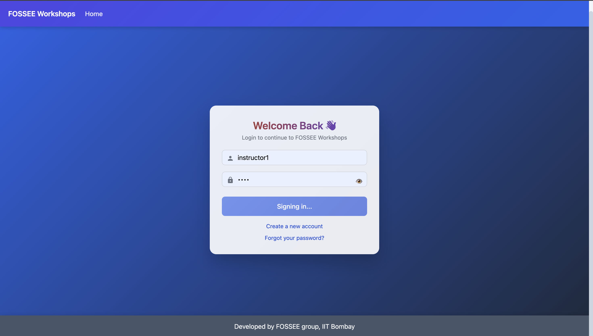
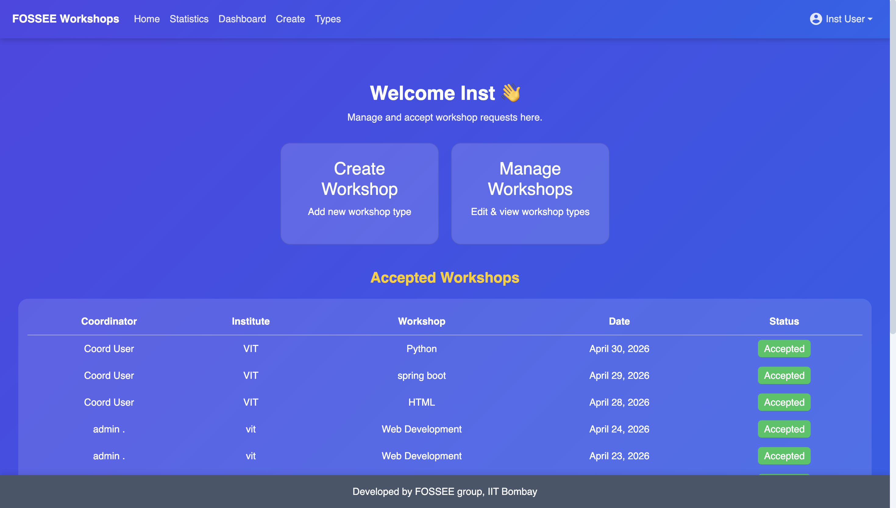
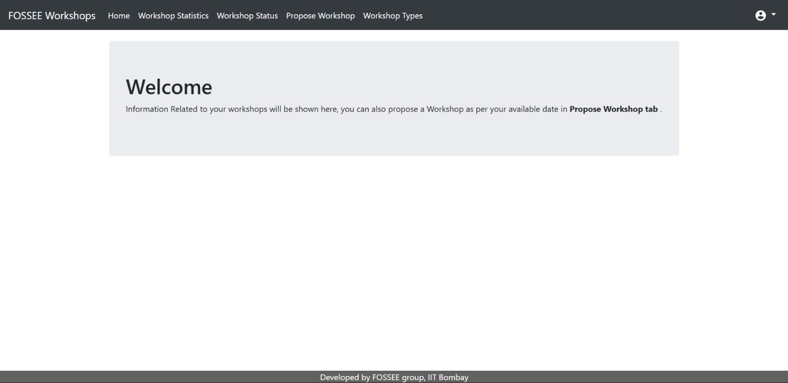
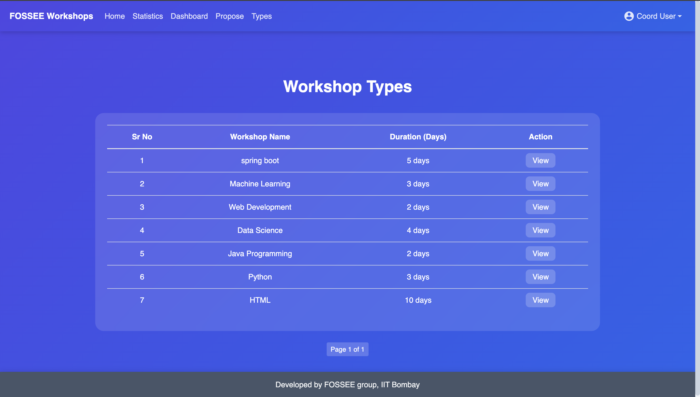
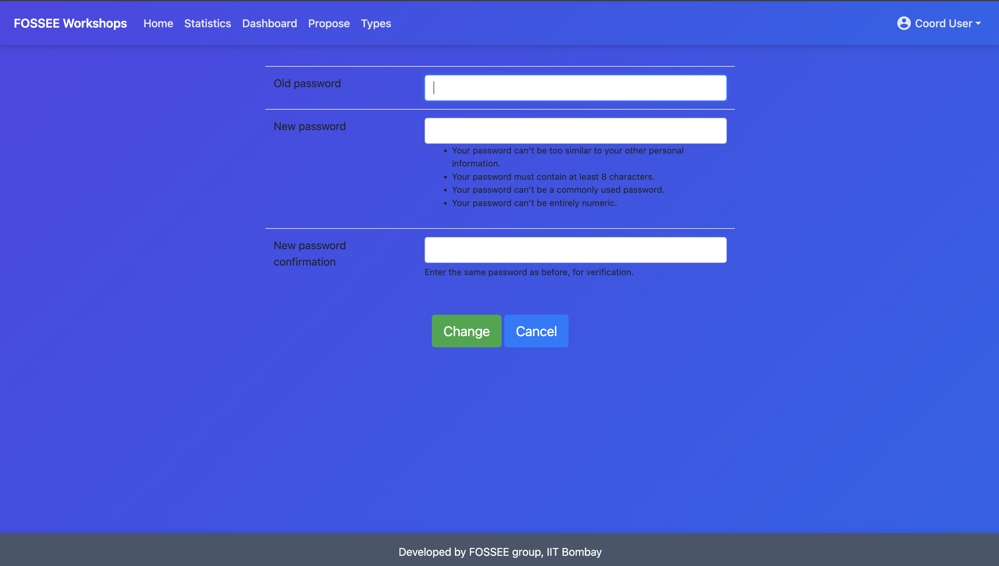
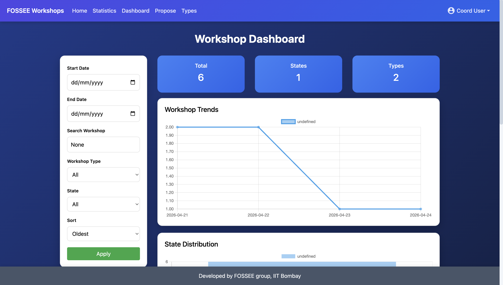

# Enhancing UI/UX of Workshop Booking System (FOSSEE Task)

> A mobile-first design to improve usability and user experience of the booking portal for students.

## About the Project

Enhancement of the existing UI/UX of the original FOSSEE Workshop Booking System.

Objective:

* 📱 Responsive design
* 🎨 Modern and aesthetic UI
* ⚡ Performance optimizations
* ♿ Accessible
* 🔍 Enhanced user experience and user interface

The original booking system was functional but barebones. The aim here was to make the design more visually pleasing and modern as well as enhance its usability and accessibility.


## Technology Used

* React
* HTML5/CSS3
* Bootstrap/Custom CSS
* Django (backend was unchanged)


## Enhancements Made

### UI Design Enhancements

* Modern design with gradient effects and Glassmorphism
* Font styles have been improved
* Color Contrast has been enhanced

### Mobile-First Approach

* All pages are fully responsive
* Forms are optimized for mobile screens
* Touch friendly interfaces

### Dashboard Design Enhancements

* Cards used to give structure to dashboard
* Data visualization has been improved

### UX Enhancements

* Navigation has been improved
* Clear Call-To-Actions provided
* Form design has been improved

## 🔄 UI Comparison: Old vs New

Below is a side-by-side comparison of the previous UI and the redesigned UI to highlight improvements in design, usability, and user experience.

---

### 📸 Visual Comparison

<table>
<tr>
<td align="center"><b>Old UI</b></td>
<td align="center"><b>New UI</b></td>
</tr>

<tr>
<td></td>
<td></td>
</tr>

<tr>
<td></td>
<td></td>
</tr>

<tr>
<td></td>
<td></td>
</tr>

<tr>
<td></td>
<td></td>
</tr>

<tr>
<td></td>
<td></td>
</tr>
</table>
---


### Note

All screenshots were captured from locally running instances of both versions of the project. The redesign focuses on improving usability, visual clarity, and overall user experience.

## 🖥 Desktop UI Preview

|  |  |  |  |
|--|--|--|--|
|  |  |  |  |
|  |  |  |  |
|  |  |  |  |
|  |  |  |  |
|  |  |  |  |
|  |  |  |  |

---

## 📱 Mobile UI Preview

|  |  |  |  |
|--|--|--|--|
|  |  |  |  |
|  |  |  |  |
|  |  |  |  |
|  |  |  |  |
|  |  |  |  |
|  |  |  |  |


### 🎥 Demo Video
[Click here to watch video](changes_in_ui/Vid.mov)


## 👥 User Roles & Account Setup

This system supports two types of users:

### 👨‍🏫 Instructor
- Can **accept workshops**
- Can **edit workshop types**
- Can **update workshop details**
- Has higher privileges in the system

### 👨‍💼 Coordinator
- Can **propose workshops**
- Can **manage their own workshops**
- Cannot accept workshops

---
## ⚙️ Setup Instructions(Error may come during execution please follow all commands)

```bash
git clone https://github.com/your-username/workshop_booking.git
cd workshop_booking
python -m venv venv
venv\Scripts\activate      # Windows
source venv/bin/activate   # Mac/Linux
pip install -r requirements.txt
rmdir /s /q venv
py -3.9 -m venv venv
venv\Scripts\activate
pip install -r requirements.txt
python manage.py migrate
python manage.py runserver
```

## Quick Account Setup (Without Email Verification)

Since email verification is disabled for testing, users can be created directly using Django shell.

### 🔹 Step 1: Open shell

```bash
python manage.py shell
```

### 🔹 Step 2: Create Instructor

```bash
from django.contrib.auth.models import User, Group
from workshop_app.models import Profile

user, created = User.objects.get_or_create(
    username='instructor_user',
    defaults={'email': 'instructor@gmail.com'}
)

if created:
    user.set_password('1234')
    user.save()

profile, _ = Profile.objects.get_or_create(user=user)
profile.is_email_verified = True
profile.save()

group, _ = Group.objects.get_or_create(name='instructor')
user.groups.add(group)

print("Instructor created successfully ✅")
```


### 🔹 Step 3: Create Coordinator

```bash
from django.contrib.auth.models import User
from workshop_app.models import Profile

user, created = User.objects.get_or_create(
    username='coordinator_user',
    defaults={'email': 'coordinator@gmail.com'}
)

if created:
    user.set_password('1234')
    user.save()

profile, _ = Profile.objects.get_or_create(user=user)
profile.is_email_verified = True
profile.save()

print("Coordinator created successfully ✅")
```

Go and Login using the user_id and password


A new Login Page has been implemented using React in the frontend.

---

To run the React frontend:

```bash
cd frontend
npm install
npm start
```

## Design Decisions & Justification (Reasoning)

### What design principles guided your improvements?

The redesign was guided by core UI/UX principles to enhance usability and clarity:

- Visual Hierarchy – Key actions such as proposing and accepting workshops were emphasized using size, spacing, and contrast to guide user attention.  
- Consistency – A uniform design system (colors, buttons, layouts) was maintained across all pages to ensure a predictable and smooth user experience.  
- Minimalism – Unnecessary elements were removed to reduce clutter and keep the interface clean and focused.  
- Accessibility – Improved color contrast, readable typography, and proper spacing were used to make the interface usable for a wider range of users.  
- User Feedback – Clear success/error messages and interactive states were added to improve user interaction and understanding.  

---

### How did you ensure responsiveness across devices?

Responsiveness was achieved using a mobile-first approach:

- Designed layouts starting from small screens and scaled up for larger devices  
- Used flexbox and responsive grid systems for flexible layouts  
- Avoided fixed widths so components adapt naturally to different screen sizes  
- Optimized buttons and forms for better touch interaction on mobile devices  
- Tested layouts across multiple screen sizes to ensure consistency  

---

### What trade-offs did you make between design and performance?

While improving the UI/UX, performance was carefully considered:

- Avoided heavy animations to maintain fast load times  
- Used lightweight styling instead of heavy UI frameworks  
- Limited external dependencies to reduce overhead  
- Focused on usability and clarity rather than overly complex designs  

This ensured the system remains fast, efficient, and user-friendly.

---

### What was the most challenging part of the task and how did you approach it?

The most challenging part was enhancing the UI without breaking the existing Django backend logic.

- Django templates are tightly coupled with backend data, so even small UI changes could disrupt functionality  
- Managing static files (CSS, JavaScript, images) consistently across pages was challenging  
- Ensuring proper responsiveness required multiple iterations  

Approach:

- Made incremental changes and tested each component carefully  
- Preserved backend structure while improving frontend templates  
- Debugged issues step-by-step to maintain functionality  
- Ensured core features like authentication, booking workflows, and validations remained intact  

---

### Outcome

The final system is:

- More intuitive and user-friendly  
- Fully responsive across devices  
- Visually modern while maintaining performance  
- Efficient and easy to navigate for both instructors and coordinators

